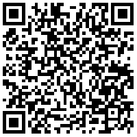
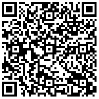
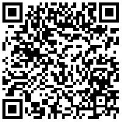

# dropload
a javascript implementation of pull to refresh and up to loadmore
<br />
移动端下拉刷新、上拉加载更多插件

## 背景介绍 (introduce)

感谢交流群和github上的网友反馈和建议，修复两个bug。并且把某些demo里ajax获取数据部分从原来的假json改为真正的数据接口，让例子更接近线上开发环境。

[历史背景介绍](Intro.md)

## 最新版本 (The latest version)

### 0.9.1(161205)

* 修复不调用loadDownFn报错bug
* 修复窗口改变resize未触发加载数据bug

[所有更新日志](Changelog.md)

## 示例 (demo)


[DEMO1，加载底部(loadmore)](http://ximan.github.io/dropload/examples/load-bottom.html)


[DEMO2，加载顶部、底部(refresh & loadmore)](http://ximan.github.io/dropload/examples/load-top-bottom.html)


[DEMO3，特殊布局，加载顶部、底部(refresh & loadmore with fixed navbar)](http://ximan.github.io/dropload/examples/product-list.html)


[DEMO4，按需加载](http://ximan.github.io/dropload/examples/multiple-load.html)


[DEMO5，tab加载数据](http://ximan.github.io/dropload/examples/tab.html)

## 依赖 (dependence)

Zepto 或者 jQuery 1.7以上版本，推荐jQuery 2.x版本（二者不要同时引用）
<br />
Zepto or jQuery 1.7+，recommend to use jQuery 2.x（not use them at the same time）

## 使用方法 (usage)

引用css和js
<br />
(basic)

    <link rel="stylesheet" href="../dist/dropload.css">
    <script src="../dist/dropload.min.js"></script>

````
$('.element').dropload({
    scrollArea : window,
    loadDownFn : function(me){
        $.ajax({
            type: 'GET',
            url: 'json/more.json',
            dataType: 'json',
            success: function(data){
                alert(data);
                // 每次数据加载完，必须重置
                me.resetload();
            },
            error: function(xhr, type){
                alert('Ajax error!');
                // 即使加载出错，也得重置
                me.resetload();
            }
        });
    }
});
````
（注明：所有示例里`ajax`和`setTimeout`都是为了模拟加载效果而写的，与本插件无直接关系。`ajax`建议自己写，无特殊情况不必copy我的`ajax`写法，因为写得太烂。如需下载本地运行，请在本机装服务器环境，否则`ajax`会报错。）

## 参数列表 (options)

|    参数     |     说明     |  默认值 |      可填值     |
|------------|-------------|--------|----------------|
| scrollArea | 滑动区域      | 绑定元素自身 | window |
| domUp      | 上方DOM      | {<br/>domClass : 'dropload-up',<br/>domRefresh : '&lt;div class="dropload-refresh"&gt;↓下拉刷新&lt;/div&gt;',<br/>domUpdate  : '&lt;div class="dropload-update"&gt;↑释放更新&lt;/div&gt;',<br/>domLoad : '&lt;div class="dropload-load"&gt;○加载中...&lt;/div&gt;'<br/>} | 数组 |
| domDown    | 下方DOM      | {<br/>domClass : 'dropload-down',<br/>domRefresh : '&lt;div class="dropload-refresh"&gt;↑上拉加载更多&lt;/div&gt;',<br/>domLoad : '&lt;div class="dropload-load"&gt;○加载中...&lt;/div&gt;',<br/>domNoData : '&lt;div class="dropload-noData"&gt;暂无数据&lt;/div&gt;'<br/>}  | 数组 |
| autoLoad   | 自动加载      | true | true和false |
| distance   | 拉动距离      | 50 | 数字 |
| threshold  | 提前加载距离   | 加载区高度2/3 | 正整数 |
| loadUpFn   | 上方function | 空  | function(me){<br/>//你的代码<br/>me.resetload();<br/>} |
| loadDownFn | 下方function | 空  | function(me){<br/>//你的代码<br/>me.resetload();<br/>} |

## API

暴露一些功能，可以让dropload更灵活的使用

`lock()` 锁定dropload

|      参数      |             说明            |
|----------------|----------------------------|
| `lock()`       | 智能锁定，锁定上一次加载的方向 |
| `lock('up')`   | 锁定上方                    |
| `lock('down')` | 锁定下方                    |

`unlock()` 解锁dropload

`noData()` 无数据

|      参数      |             说明            |
|----------------|----------------------------|
| `noData()`     |           无数据            |
| `noData(true)` |           无数据            |
| `noData(false)`|           有数据            |

`resetload()` 重置。每次数据加载完，必须重置

## 已知问题

* 由于部分Android中UC和QQ浏览器头部有地址栏，并且一开始滑动页面隐藏地址栏时，无法触发scroll和resize，所以会导致部分情况无法使用。解决方案1：增加distance距离，例如DEMO2中distance:50；解决方案2：加`meta`使之全屏显示
````
<meta name="full-screen" content="yes">
<meta name="x5-fullscreen" content="true">
````
例如DEMO1

## dropload使用交流群

[群号：290725368，点击加群](http://shang.qq.com/wpa/qunwpa?idkey=2c58606fdfb5d6be4021a678e1506fdbbbc480aabdca0eeb115c2f4ff5bc69ee)
"# page-app" 
